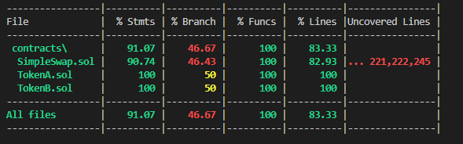

# SimpleSwap Dapp — Scaffold-ETH 2

> Proyecto de ejemplo: Liquidez y Swap de tokens ERC20 sobre Scaffold-ETH 2  
> ⚡️ Desarrollado por [Leandro Gómez](https://github.com/leogz-ar)

---

## 🚀 Instalación

```bash
git clone https://github.com/scaffold-eth/scaffold-eth-2.git
cd scaffold-eth-2
yarn install
```

---

## ⚒️ **Preparar el Proyecto**

Antes de correr los comandos de desarrollo:

1. **Elimina el ejemplo:**  
   Borra el contrato `YourContract.sol` de la carpeta `contracts`  
   Borra el archivo de deploy correspondiente en `deploy/00_deploy_your_contract.ts`

2. **Agrega tus contratos:**  
   Copia `SimpleSwap.sol`, `TokenA.sol` y `TokenB.sol` a la carpeta `contracts/`
   
3. **Configura tu script de deploy**  
   Crea un nuevo archivo de deploy para tus contratos en `deploy/`

---

## 🖥️ **Desarrollo Local: 3 Ventanas**

Abre **3 terminales** (o usa los paneles de VSCode):

1. **Ventana 1: Inicializar blockchain local**
   ```bash
   yarn chain
   ```

2. **Ventana 2: Desplegar los contratos inteligentes**
   ```bash
   yarn deploy
   ```

3. **Ventana 3: Iniciar el Front-End**
   ```bash
   yarn start
   ```

---

## 🧪 **Testing y Coverage**

Una vez desplegado y con los tests creados, podés correr:

```bash
npx hardhat test
npx hardhat coverage
```

---

### 📈 **Ejemplo de Coverage**

> **Tip:** Lo más importante es el porcentaje de líneas (`% Lines`).  
> Aunque `% Branch` sea bajo, si `% Lines` está arriba del 50% tu proyecto está cubierto para la mayoría de los cursos y entregas.



---

## 📢 Notas

- **Scaffold-ETH 2** te da el entorno ideal para prototipar y testear tus dapps de forma rápida y sencilla.
- Si modificás los contratos, repetí los pasos de deploy y test para mantener el coverage.

---

## 🧑‍💻 Autor

[Leandro Gómez (leogz-ar)](https://github.com/leogz-ar)

---
